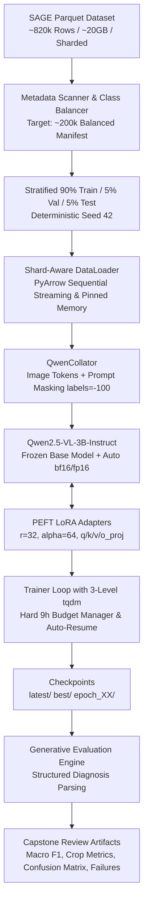

# SAGE — Scalable Agentic Grounded Evaluation for Crop Disease Diagnosis
## Qwen2.5-VL-3B LoRA Production Training Pipeline (Phase-1)

[](https://www.python.org/downloads/)
[](https://github.com/huggingface/peft)
[](https://huggingface.co/Qwen/Qwen2.5-VL-3B-Instruct)
[](https://huggingface.co/datasets/tirtho149/SAGE)

---

## 1. System Architecture



---

## 2. Directory Structure

```
SAGE-Implementation/
├── README.md                           # Master documentation & Kaggle execution guide
├── requirements.txt                    # Python dependencies
├── .gitignore                          # Ignores model weights, raw parquets & tokens
├── configs/
│   └── config.yaml                     # Central configuration for model, lora, data, training
├── src/
│   ├── __init__.py                     # Package init
│   ├── dataset.py                      # Shard-aware dataset, image decoding, label masking
│   ├── prompts.py                      # Multi-turn conversation format & regex response parser
│   ├── model.py                        # Hardware detection, quantization & PEFT LoRA setup
│   ├── trainer.py                      # 3-level tqdm bars, 9h budget manager, resumable training
│   ├── evaluation.py                   # Generative evaluation loop & final report generator
│   ├── metrics.py                      # Accuracy, Macro F1, top confusions, crop breakdown
│   └── utils.py                        # Seed, budget manager, filesystem helpers
├── scripts/
│   ├── inspect_dataset.py              # Schema, row counts, and prompt preview
│   ├── prepare_manifest.py             # Class balancing & 90/5/5 manifest generation
│   ├── smoke_test.py                   # Cloud/Kaggle GPU end-to-end smoke test
│   ├── train.py                        # Main training pipeline entrypoint
│   ├── evaluate.py                     # Standalone checkpoint evaluation
│   ├── infer.py                        # Single-image visual diagnosis CLI
│   └── demo_batch.py                   # Batch qualitative evaluation (10-20 images)
├── train.py                            # Root forwarder script
├── artifacts/
│   ├── data/                           # Manifest parquets (train, val, test)
│   ├── metrics/                        # Classification reports, crop metrics, confusion matrix
│   ├── predictions/                    # Qualitative batch predictions JSON
│   └── failures/                       # Error cases CSV and failure visual analysis
└── checkpoints/
    ├── latest/                         # Most recent step checkpoint (resumable)
    └── best/                           # Best model selected strictly by Validation Macro F1
```

---

## 3. Kaggle Cloud Execution Workflow

This pipeline is **cloud-first**: all smoke tests, manifest preparation, and training execute directly inside the Kaggle notebook environment with GPU acceleration.

### Step 1: Clone Repository in Kaggle
In your Kaggle Notebook cell (with **GPU P100** or **2x T4** enabled):

```bash
!git clone https://github.com/Chaitanya-idk/SAGE-Implementation.git
%cd SAGE-Implementation
!pip install -r requirements.txt
```

### Step 2: Inspect Dataset
Inspect the dataset columns, distribution, and prompt formatting:

```bash
!python scripts/inspect_dataset.py
```
*(If you have SAGE Parquet files already attached as a Kaggle dataset, add `--data-dir /kaggle/input/your-dataset-name`)*

### Step 3: Generate Balanced Manifests (~200k Examples)
Prepare the balanced 90% Train / 5% Val / 5% Test manifests stratified by `canonical_disease`:

```bash
!python scripts/prepare_manifest.py
```
This generates:
- `artifacts/data/train_manifest.parquet` (~180,000–200,000 samples)
- `artifacts/data/val_manifest.parquet` (~10,000 samples)
- `artifacts/data/test_manifest.parquet` (~10,000 samples)
- `artifacts/data_statistics.json`
- `artifacts/class_distribution.csv`

### Step 4: Run Cloud GPU Smoke Test
Run the end-to-end cloud smoke test inside the Kaggle environment to verify image decoding, forward pass, LoRA parameter freezing, backward gradients, optimizer stepping, checkpoint save/reload, and generative output parsing:

```bash
!python scripts/smoke_test.py
```

### Step 5: Launch Full Production Training
Start the training process with 3-level progress bars and the 9-hour compute budget guard:

```bash
!python scripts/train.py --config configs/config.yaml
```

### Step 6: Resuming Training After Disconnect
If the Kaggle session disconnects or you restart the notebook, resume immediately from the latest checkpoint without losing progress:

```bash
!python scripts/train.py --config configs/config.yaml --resume checkpoints/latest
```

---

## 4. Key Engineering & Design Decisions

### A. Primary Objective: `canonical_disease`
- The model is trained strictly on the normalized `canonical_disease` taxonomy.
- Metadata fields `visual_symptoms`, `plant_organ`, `pathogen`, and `disease_type` are appended **only when available in the row**; nonexistent fields are omitted rather than hallucinated.
- Provenance columns (`raw_label`, `filename`, `symptom_source`, `symptom_quote`) are excluded from training targets and preserved for RAG grounding.

### B. Shard-Aware Memory Efficiency
- **No full 20GB dataset in RAM**: manifests store lightweight row indices and shard references.
- Images are decoded lazily on-demand.
- The base model stays loaded in memory across all shards and batches without recreation.
- Corrupted images are automatically logged to `artifacts/bad_samples.csv` without halting training.

### C. 10-Hour Compute Budget Guard
- `max_training_hours: 9.0` ensures the training loop cleanly finishes at a safe step boundary before Kaggle's 10-hour hard limit expires.
- Full optimizer state, scheduler state, RNG state, and LoRA weights are saved to `checkpoints/latest/`.

### D. Metric-Driven Best Model Selection
- Imbalanced datasets make raw accuracy misleading.
- The `best` checkpoint is selected based on **Validation Macro F1** (primary) and **Normalized Disease Accuracy** (secondary).

---

## 5. Evaluation & Inference

### Single Image Visual Diagnosis
```bash
!python scripts/infer.py --image path/to/leaf.jpg --checkpoint checkpoints/best --crop Soybean
```
**Sample Output:**
```
=================================================================
 SAGE MULTIMODAL AGRICULTURAL DIAGNOSIS
=================================================================
 Input Image:       samples/soybean_leaf.jpg
 Crop:              Soybean
 Diagnosis:         Bacterial Pustule
 Disease Type:      Bacterial
 Plant Organ:       Leaf
 Visual Symptoms:   Small raised pustules and chlorotic spotting
 Pathogen:          Xanthomonas axonopodis pv. glycines
-----------------------------------------------------------------
```

### Batch Qualitative Evaluation
Run evaluation on 20 held-out test images:
```bash
!python scripts/demo_batch.py --checkpoint checkpoints/best --num-samples 20
```

### Standalone Test Evaluation
```bash
!python scripts/evaluate.py --checkpoint checkpoints/best --split test
```

---

## 6. Capstone Review Deliverables

Upon completion, all outputs required for capstone evaluation are generated automatically:
1. `artifacts/final_report.md` & `artifacts/final_report.json`
2. `artifacts/metrics/classification_report.csv` (per-class Precision, Recall, F1)
3. `artifacts/metrics/crop_metrics.csv` (performance segmented by crop)
4. `artifacts/metrics/top_confusions.csv` (most common misclassification pairs)
5. `artifacts/metrics/confusion_matrix.png` (readable high-res heatmap)
6. `artifacts/failures.csv` (full breakdown of incorrect predictions)
